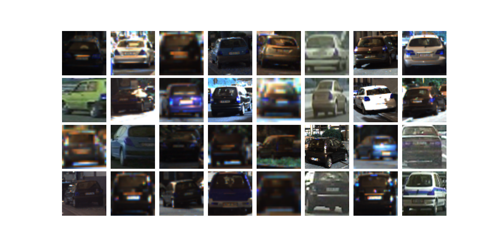
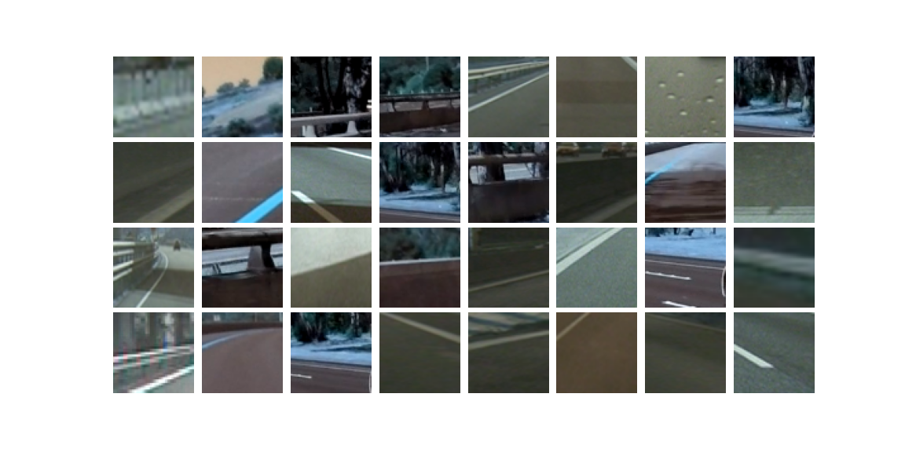
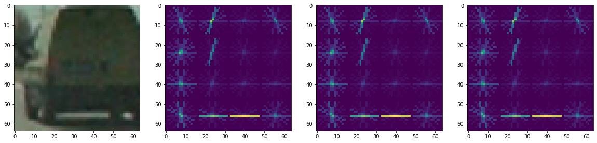
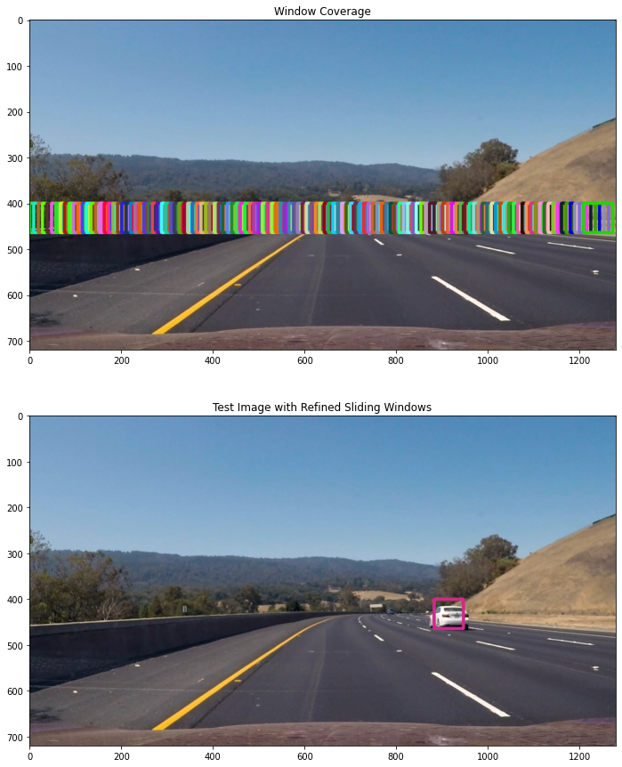
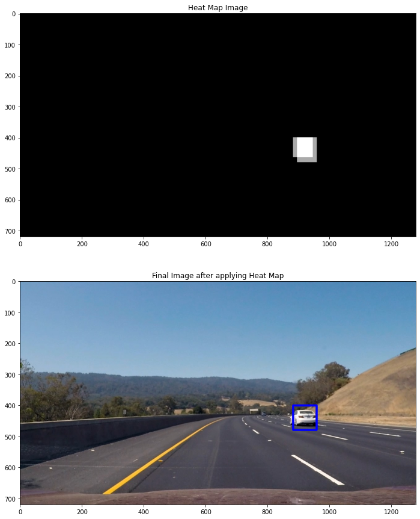

# Vehicle Classification using HOG and KNN

## Steps of the project

- Perform a Histogram of Oriented Gradients (HOG) feature extraction on a labeled training set of images and train a KNN classifier.
- Trying sliding-window technique and use your trained classifier to search for vehicles in images.

**Complete Code is availabel [Here](https://github.com/vishalrk1/Vehicle-Classification-using-HOG-and-KNN/blob/main/Car_Detection_HOG_KNN.ipynb)**

## 1. Loading Imaes
All the images from the vehicles and non-vehicles folder were loaded. It was resized into 64x64 and converted to vehicles.
```python
#read images from file names and resizes to 64,64
def data_read_images_from_files(file_names):
    images = [];
    for file in file_names:
        image = cv2.cvtColor(cv2.imread(file),cv2.COLOR_BGR2RGB);
        image = cv2.resize(image,dsize=(64,64))
        images.append(image);
    return np.array(images)
```
- **Example of car images**
<p float="left">
  
</p>

- **Example of non-car images**
<p float="left">
  
</p>

## 2. Feature Extraction
- The code for extracting the hog features is mentioned in the function GetFeaturesFromHog. This function returns two things (hog_features, hog_image) if visualisation is set to true else this function returns only hog_features.
```python
def GetFeaturesFromHog(image,orient,cellsPerBlock,pixelsPerCell, visualise= False, feature_vector_flag=True):
    if(visualise==True):
        hog_features, hog_image = hog(image, orientations=orient,
                          pixels_per_cell=(pixelsPerCell, pixelsPerCell), 
                          cells_per_block=(cellsPerBlock, cellsPerBlock), 
                          visualise=True, feature_vector=feature_vector_flag)
        return hog_features, hog_image
    else:
        hog_features = hog(image, orientations=orient,
                          pixels_per_cell=(pixelsPerCell, pixelsPerCell), 
                          cells_per_block=(cellsPerBlock, cellsPerBlock), 
                          visualise=False, feature_vector=feature_vector_flag)
        return hog_features
```
- HOG feature extraction example
<p float="left">
  
</p>

- The HOG function expects a single channel image. So we defined a method ```ExtractFeatures``` which calls the function ```GetFeaturesFromHog``` and stacks all the features returned from different color channels
```python

def ExtractFeatures(images,orientation,cellsPerBlock,pixelsPerCell, convertColorspace=False):
    featureList=[]
    imageList=[]
    for image in images:
        if(convertColorspace==True):
            image= cv2.cvtColor(image, cv2.COLOR_RGB2YUV)
        local_features_1=GetFeaturesFromHog(image[:,:,0],orientation,cellsPerBlock,pixelsPerCell, False, True)
        local_features_2=GetFeaturesFromHog(image[:,:,1],orientation,cellsPerBlock,pixelsPerCell, False, True)
        local_features_3=GetFeaturesFromHog(image[:,:,2],orientation,cellsPerBlock,pixelsPerCell, False, True)
        x=np.hstack((local_features_1,local_features_2,local_features_3))
        featureList.append(x)
    return featureList
```

## 3. Preparing Training Data
- After Extracting all the features from vehicle and non vehicle images, we created the final feature set by stacking them together and then created the final labels by stacking ones equal to length of vehicle data and stacking zeros equal to length of non vehicle data

```python
featuresList= np.vstack([vehicleFeatures, nonVehicleFeatures])
labelList= np.concatenate([np.ones(len(vehicleFeatures)), np.zeros(len(nonVehicleFeatures))])
```

    Shape of features list is  (17760, 972)
    Shape of label list is  (17760,)
    
- We then divided the featureList and labelList into train and test set

```python
X_train, X_valid, y_train, y_valid = train_test_split(featureList, labelList, test_size=0.2, random_state=101)
```
    
- Then we scaled the feature vector using a standard scaler. This will help optimizer to converge faster.

```python
X_scaler = StandardScaler().fit(X_train)
scaled_X = X_scaler.transform(X_valid)
```
## 4. Training KNN Classifier

The final step is to train the classifier. we used KNeighborsClassifier with default parameteres ans took n_neighbors as 7. 
we were able to achieve a test accuracy of 98.7 % and that too in less than 2 seconds!! Well that was really very fast!
```python
knn = KNeighborsClassifier(n_neighbors=7,  n_jobs=-1)
knn.fit(X_train, y_train)
print(f'Model score: {knn.score(X_test, y_test)}')
```

## 5. Method for detection
Further we can detect cars in images using sliding window method
The basic points to note here are-
- The cars will be basically in the lower half of the image so the we will search only in the lower half of the image.
- The cars near the chosen horizon will be small and will increase in size as we move from the horizon towards the car.
- It makes sense to search for 64x64 car in only one window starting from horizon and increase the window size as we move from horizon towards car
- For Windows of different sizes  we need to resize the window back to 64x64 because while training the classifier we trained on features extracted from 64x64 image.
- The overlap selected was based on the fact that all possible points were covered. I searched for one bar of 64x64 window size near the horizon with more overlapping(85%) windows. Then I decided to search for one bar of 80x80 window size near the horizon with overlapping of 80%.
- There were a lot of false positives when I was using more windows. Intitally I was searching for all

The final windows selected were-

| Window Size | Overlap | Y Start | Y Stop |
|-------------|---------|---------|--------|
| 64x64       | 85      | 400     | 464    |
| 80x80       | 80      | 400     | 480    |

**Get all the windows list using [Windows_list.py](https://github.com/vishalrk1/Vehicle-Classification-using-HOG-and-KNN/blob/main/windows_list.py)

```python
# function that returns the refined Windows
# From Refined Windows we mean that the windows where the classifier predicts the output to be a car
def DrawCars(image,windows, converColorspace=False):
    refinedWindows=[]
    for window in windows:
        
        start= window[0]
        end= window[1]
        clippedImage=image[start[1]:end[1], start[0]:end[0]]
        
        if(clippedImage.shape[1] == clippedImage.shape[0] and clippedImage.shape[1]!=0):
            
            clippedImage=cv2.resize(clippedImage, (64,64))
            
            f1=ExtractFeatures([clippedImage], 9 , 2 , 16,converColorspace)
        
            predictedOutput=classifier1.predict([f1[0]])
            if(predictedOutput==1):
                refinedWindows.append(window)
        
    return refinedWindows
```
**The total number of windows we got were 203. Below is the image for coverage of windows, i.e. the area where the code will be searching for windows**

    Total No of windows are  203

<p float="left">
  
</p>

Once we were able to detect the car by using Sliding Window approach. The next we decided to use a heatup to plot the final bounding boxes around the car. we defined a function add_heat that increments the pixel value of an black image the size of the original image at the location of each detected window which we called as refined Window.


```python
def add_heat(heatmap, bbox_list):
    for box in bbox_list:
        # Add += 1 for all pixels inside each bbox
        # Assuming each "box" takes the form ((x1, y1), (x2, y2))
        heatmap[box[0][1]:box[1][1], box[0][0]:box[1][0]] += 1
    return heatmap 
```

The next step was to remove the false positives. This function blacks out the pixels who have value less than threshold value

```python
def apply_threshold(heatmap, threshold):
    # Zero out pixels below the threshold
    heatmap[heatmap <= threshold] = 0
    # Return thresholded map
    return heatmap
```

**Finally the next point is to draw bounding boxes on the final image**
<p float="left">
  
</p>
